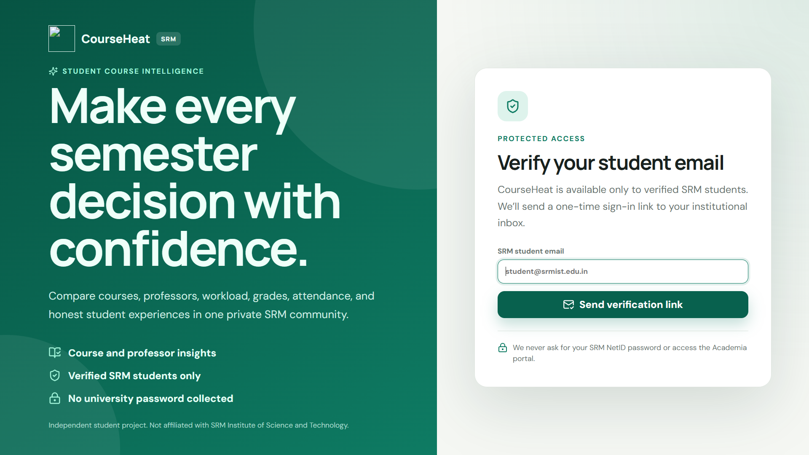
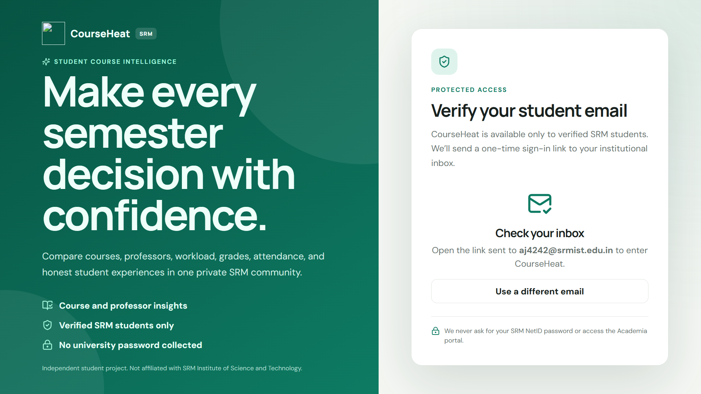
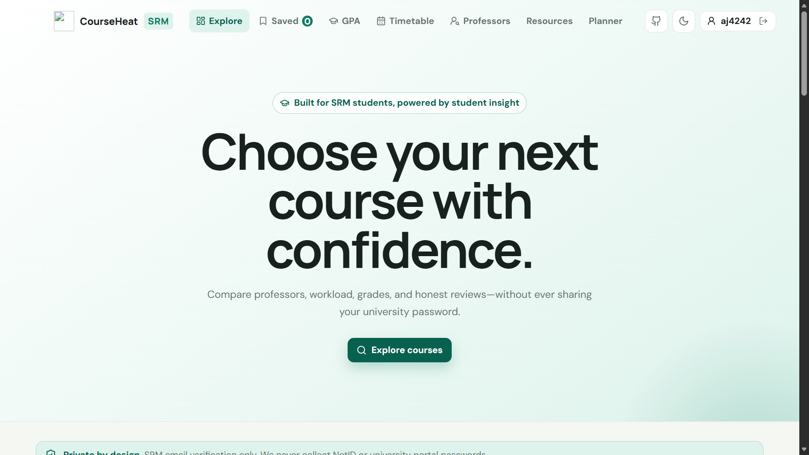
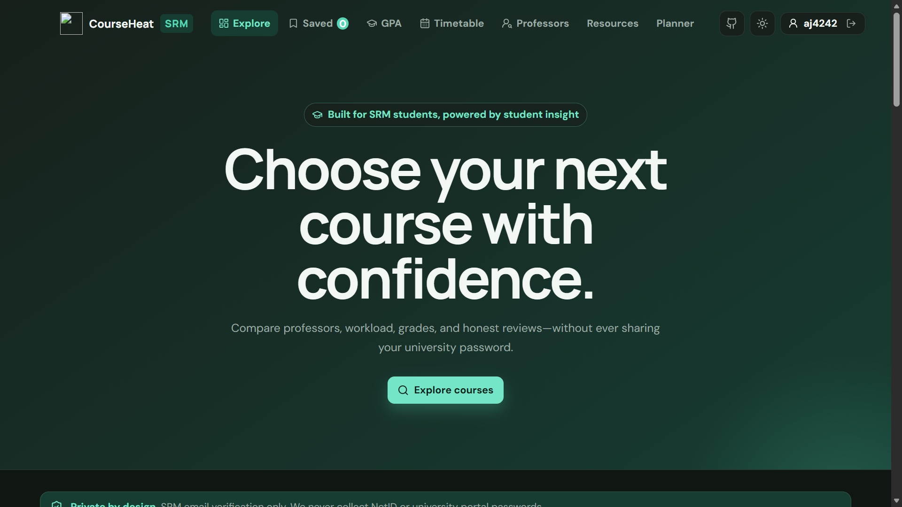
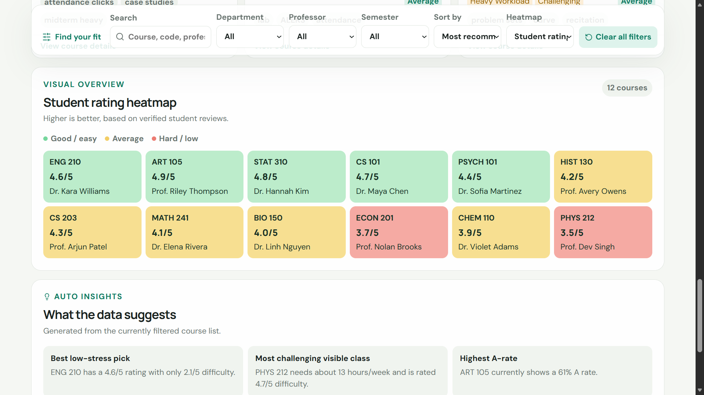

<div align="center">

# 🎓 CourseHeat SRM

### A secure, mobile-first student dashboard for course discovery, reviews, GPA planning, timetables, and professor comparisons.

<br />

<a href="https://www.linkedin.com/in/anant-jodha/">
  
</a>

<br />
<br />


<br />
<br />


<br />
<br />








</div>

---

## 📌 About The Project

**CourseHeat SRM** is a privacy-conscious student platform designed to make course planning easier. Verified SRM students can search courses, compare professors, explore grade distributions, submit reviews, save courses, plan a semester, maintain a timetable, and estimate GPA from one responsive interface.

The application uses passwordless authentication through an `@srmist.edu.in` email address. It **never asks for an SRM NetID or Academia portal password**.

> [!IMPORTANT]
> CourseHeat does not automatically retrieve official SRM Academia records. GPA, attendance, registered courses, and timetable entries are mock or user-managed unless SRM provides an authorized API integration.

CourseHeat is an independent student project and is not affiliated with SRM Institute of Science and Technology.

---

## ✨ Key Features

| Feature | Description |
|---|---|
| 🔐 Verified Student Access | Passwordless magic-link login for `@srmist.edu.in` email addresses |
| 🔎 Course Discovery | Search by course code, title, professor, department, and tags |
| 🎛️ Smart Filters | Filter by department, professor, and semester; sort by useful course metrics |
| 📊 Course Insights | Rating, difficulty, workload, A-rate, attendance, and recommendation scores |
| 🗺️ Course Heatmap | Color-coded course overview with a clear metric legend |
| 💬 Student Reviews | Validated reviews, tags, duplicate warnings, editing, and moderation |
| 🚩 Review Reports | Students can report questionable reviews to moderators |
| ⚖️ Course Comparison | Compare two or three courses and export the result as CSV |
| 👨‍🏫 Professor Comparison | Compare independent professor records side by side |
| ❤️ Saved Courses | Save courses and synchronize them with the authenticated account |
| 🧮 GPA Dashboard | Track grades, credits, semester GPA, and cumulative GPA |
| 🗓️ Weekly Timetable | Add classes, rooms, class types, and detect schedule conflicts |
| ✅ Semester Planner | Create and synchronize academic tasks and deadlines |
| 📚 Resource Hub | Community notes, PYQs, links, and learning resources |
| 🛡️ Admin Dashboard | Moderate reviews, reports, courses, and community content |
| 🌗 Theme Support | Responsive light and dark modes saved locally |
| 📤 Import And Export | Manual CSV import, course exports, comparison exports, and copyable summaries |

---

## 🛠️ Tech Stack

| Technology | Usage |
|---|---|
| **React 18** | Component-based frontend |
| **TypeScript** | Type-safe application logic |
| **Vite 6** | Development server and production build |
| **Supabase Auth** | Passwordless SRM email verification |
| **Supabase Postgres** | Reviews, users, saves, planner data, and moderation records |
| **Row Level Security** | Ownership and role-based database access |
| **Chart.js** | Grade and comparison visualizations |
| **Lucide React** | Interface icons |
| **CSS3** | Responsive, mobile-first design and theming |
| **localStorage** | Theme and local student-managed data caching |

---

## 📂 Folder Structure

```text
course-review-heatmap/
├── public/
│   └── logo.svg
├── scripts/
│   └── validate-project.mjs
├── src/
│   ├── components/
│   │   ├── AuthGate.tsx
│   │   ├── CourseDetail.tsx
│   │   ├── GpaDashboard.tsx
│   │   ├── ProfessorComparison.tsx
│   │   ├── SemesterPlanner.tsx
│   │   └── TimetableCalendar.tsx
│   ├── data/
│   │   └── mockCourses.ts
│   ├── lib/
│   │   ├── courseUtils.ts
│   │   ├── storage.ts
│   │   └── supabase.ts
│   ├── styles/
│   │   └── index.css
│   ├── App.tsx
│   ├── main.tsx
│   └── types.ts
├── supabase/
│   └── schema.sql
├── .env.example
├── index.html
├── package.json
├── README.md
└── vite.config.ts
```

---

## 🚀 Getting Started

### ✅ Prerequisites

Install a current LTS version of **Node.js** and npm.

```bash
node -v
npm -v
```

You also need a [Supabase](https://supabase.com/) project because the application remains locked until a verified session is available.

### 📥 Installation

Clone the repository:

```bash
git clone https://github.com/AnantJodhaRathore/course-review-heatmap.git
cd course-review-heatmap
```

Install the exact dependency versions from the lockfile:

```bash
npm ci
```

---

## ⚙️ Supabase Configuration

1. Create a Supabase project.
2. Open the Supabase SQL Editor and run [`supabase/schema.sql`](supabase/schema.sql).
3. Open **Authentication → URL Configuration**.
4. Set the Site URL and add redirect URLs for local and deployed environments.
5. Enable email magic-link authentication and configure email delivery.
6. Copy `.env.example` to `.env.local`.
7. Add the browser-safe project values:

```env
VITE_SUPABASE_URL=https://YOUR_PROJECT_ID.supabase.co
VITE_SUPABASE_PUBLISHABLE_KEY=YOUR_PUBLISHABLE_KEY
```

> [!WARNING]
> Never place a Supabase `service_role` key or secret key in a `VITE_` variable. Vite exposes these values to the browser. Use only the browser-safe publishable key.

The included schema enables Row Level Security on exposed tables. Students can manage only their own reviews, reports, saved courses, planner items, profiles, and resource submissions. Admin access is granted through trusted `app_metadata.role = "admin"`.

---

## ▶️ Run The Project

Start the development server:

```bash
npm run dev
```

Open the local URL shown by Vite, normally:

```text
http://localhost:5173
```

Enter a valid `@srmist.edu.in` email address and follow the magic link. Without a verified session, dashboards and student tools are not mounted.

---

## 🧪 Validate And Build

Run the project validation checks:

```bash
npm run validate
```

Create a production build:

```bash
npm run build
```

Preview the production build locally:

```bash
npm run preview
```

---

## ⚙️ Available Scripts

| Command | Description |
|---|---|
| `npm ci` | Installs the locked dependency versions |
| `npm run dev` | Starts the Vite development server |
| `npm run validate` | Runs the project validation script |
| `npm run build` | Type-checks and creates the production build |
| `npm run preview` | Previews the production build locally |

---

## 🔐 Authentication Flow

1. A visitor sees only the authentication gate.
2. The visitor enters an `@srmist.edu.in` email address.
3. Supabase sends a one-time magic link.
4. Supabase restores a verified authenticated session.
5. The application dashboard and student tools become available.
6. Signing out clears the active application session.

There is no demo-login bypass, and the app never collects a university password.

---

## 🗃️ Database Tables

| Table | Purpose |
|---|---|
| `users` | Verified student profiles |
| `departments` | Department catalog |
| `professors` | Independent professor records |
| `courses` | Course catalog and academic metrics |
| `reviews` | Student course reviews and moderation state |
| `review_reports` | Student-submitted moderation reports |
| `review_tags` | Review tag catalog and relationships |
| `saved_courses` | User-owned saved courses |
| `planner_items` | User-owned semester tasks |
| `resources` | Community-submitted learning resources |

---

## 📊 Recommendation Score

CourseHeat combines normalized student rating and A-rate, then applies smaller difficulty and workload penalties. The result is displayed on a 0–100 scale using these labels:

| Score Label | Meaning |
|---|---|
| **Highly Recommended** | Strong student outcomes and experience |
| **Good Option** | Favorable overall balance |
| **Average** | Mixed or neutral course signals |
| **Challenging** | Higher difficulty or workload |
| **Avoid If Possible** | Weak overall recommendation signals |

The score is guidance based on available data, not a prediction of a student's academic outcome.

---

## 📥 Manual CSV Import

The dashboard accepts student-controlled workload and attendance data with this header:

```csv
course_code,workload_hours,attendance_required
CS 203,9,required
MATH 241,7,false
```

The app matches `course_code` against the local catalog and updates matching rows. It does not log in to, scrape, or bypass SRM Academia.

---

## 🔒 Security And Privacy

- Accepts only `@srmist.edu.in` email addresses for student access.
- Uses one-time magic links instead of SRM passwords.
- Keeps Supabase secret and `service_role` keys out of frontend code.
- Protects student-owned rows with Supabase Row Level Security.
- Restricts admin features through trusted application metadata.
- Sends submitted reviews and resources through moderation workflows.
- Provides manual import instead of collecting university credentials.

---

## 🌐 About Official SRM Data

Email verification proves control of an SRM email account; it does **not** grant access to SRM Academia records. The current project cannot automatically show:

- Student name or registration number
- Official GPA or grades
- Official attendance
- Registered courses
- Official timetable

Real institutional data requires an officially authorized SRM API, SSO integration, or another permissioned data source. Until such access exists, use mock data or explicit student-managed imports.

---

## 🎯 Future Improvements

- Official SRM API or SSO integration, subject to written authorization
- Cloud synchronization for GPA and timetable records
- Email notification preferences for planner deadlines
- Resource file uploads with malware scanning
- Richer moderation audit logs
- Accessibility audits and keyboard-navigation improvements
- Automated unit, integration, and end-to-end tests
- Production monitoring and analytics with privacy controls

---

## 🌍 Deployment

The frontend can be deployed to Vercel, Netlify, Cloudflare Pages, or another Vite-compatible host.

Before deploying:

1. Add `VITE_SUPABASE_URL` and `VITE_SUPABASE_PUBLISHABLE_KEY` to the hosting provider's environment variables.
2. Add the production domain to Supabase Auth redirect URLs.
3. Run `npm run validate` and `npm run build`.
4. Never upload `.env.local` or any secret key.

---

## 🧩 Common Errors And Fixes

### Administrator setup required

```text
Administrator setup required: configure VITE_SUPABASE_URL and VITE_SUPABASE_PUBLISHABLE_KEY.
```

Create `.env.local`, add the browser-safe Supabase URL and publishable key, then restart the development server.

### Magic link returns to the wrong page

Add both your local URL and production URL under **Supabase Authentication → URL Configuration**, then request a new magic link.

### Access denied for a valid student email

Confirm the address ends exactly with `@srmist.edu.in` and that email authentication is enabled in Supabase.

### Database permission error

Run the complete [`supabase/schema.sql`](supabase/schema.sql) file and verify that the authenticated user owns the row being changed.

### Port 5173 is already in use

Vite normally selects the next available port automatically. Use the URL printed in the terminal.

---

## 🤝 Contributing

Contributions are welcome. Fork the repository, create a focused branch, validate the project, and open a pull request with a clear description of the change.

```bash
git checkout -b feature/your-feature
npm ci
npm run validate
npm run build
```

Please do not add code that collects SRM passwords, scrapes authenticated university pages, exposes secrets, or bypasses access controls.

---

## 🤝 Connect With Me

<div align="center">

### 👨‍💻 Anant Jodha

<a href="https://www.linkedin.com/in/anant-jodha/">
  
</a>

</div>

---

## 📄 License

This project is open source and available under the [MIT License](LICENSE).

---

<div align="center">

## ⭐ Show Your Support

If CourseHeat helps your project, give the repository a ⭐ on GitHub.

<br />


</div>